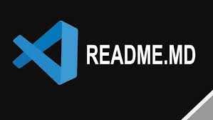

<!--  -->

# cabeçalho markdown 

###### cabeçalho markdown 

<hl>cabeçalho HTML</hl>
<!-- <h6>cabeçalho HTML</h6>  -->

## tabela de conteudo 

Este projeto foi desenvolvido com o objetivo de [descrever o propósito principal do projeto]. Ele visa oferecer uma solução prática para [problema específico], utilizando tecnologias como [listar as principais tecnologias usadas]. A aplicação foi projetada para [público-alvo ou usuário final], buscando melhorar a experiência ao [descrever a funcionalidade principal]. Com uma interface intuitiva e eficiente, esperamos proporcionar [benefício específico], tornando o processo de [tarefa relacionada ao projeto] mais simples e rápido.

A estrutura do projeto é baseada em boas práticas de desenvolvimento, com um foco em [escabilidade, performance, segurança, etc.]. O código foi organizado de forma modular, o que facilita a manutenção e contribuições de outros desenvolvedores. Além disso, incluímos uma documentação completa que abrange desde a instalação até a configuração e uso do sistema. Nossa intenção é fornecer uma ferramenta robusta e de fácil acesso para [finalidade do projeto], e qualquer contribuição é sempre bem-vinda para tornar o projeto ainda mais completo.

<ul id="menu" align="left"> 
    <li><a href="#"> Descrição do projeto </a></li>

</ul>

